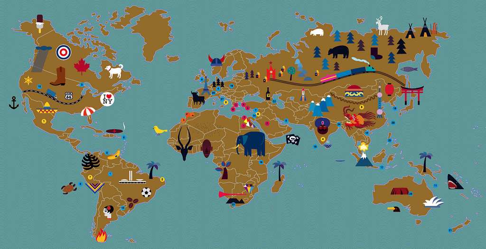

# nerdcator.org
[session] mapping nerdy places at Mozfest

*[World map](http://farm8.staticflickr.com/7123/7105972961_c17a3f75f6_b.jpg) by Maria Zaikina, available under a Creative Commons Attribution License 2.0*

* [English Version](#english)
* [German Version](#german)

## English

## Description

Although there are innumerable travel maps, books, and apps for places to see around the world, there are few such resources for scientist/nerd travelers. With *Nerdcator* we want to create an open data repository that collects such places in a crowdsourced manner, creating a global community of fellow scientists/nerds. We will demonstrate a basic app that allows travelers to find nearby sites of special interest to scientists/nerds such as geological/botanical features, offbeat museums, graves of our scientific heroes, locations of historic/scientific events/interest, and even research labs offering tours.

We want attendees to design the next iteration of the app, to refine the social and technological features that will enable *Nerdcator* to succeed where other such efforts (e.g., nerdydaytrips.com) have failed to take off. Participants can also test the app after festival hours with sites such as the Greenwich meridian line, the Cutty Sark clipper ship, or astronomer Frank Dyson’s home.

* `tools/` - various approaches in making a map app like this using some open source tools
* `sources/` - ideas on where you can get data to populate a map app
* `data/` - actual data entry points to get you started making your own nerdy app

### Facilitators

* Bastian Greshake, openSNP, [@gedankenstuecke](https://twitter.com/gedankenstuecke)
* Aurelia Moser, Mozilla Science Lab, [@auremoser](https://twitter.com/auremoser)
* Egle Marija Ramanauskaite, Human Computation Institute, [@seplute](https://twitter.com/seplute)
* Sujai Kumar, Edinburgh University, [@sujaik](https://twitter.com/sujaik)

### Session Structure

#### Talking Part:

Goal: to create a shared map for nerd travel (but the template can be used for any other kind of travel/shared interest)

Methods: (divided into two main parts)

1. Collecting data (different ways of doing this - using Google Forms, EpiCollect, WikiVoyage). Ideally show one city each
2. Displaying data (Carto, EpiCollect, OSM). Ideally in a browser, or on a smartphone

#### Doing Part:

1. Ask attendees to sign in (and let us know if they want updates on the project)
2. Encourage everyone to enter their favourite nerd travel recommendations, and to suggest sources for other nerd travel that we could scrape
3. Talk about curating data (do we need this section?). What curation model works? Authorised users?
4. Get feedback on what everyone thinks is the best way to enter/curate/view data out of the options on offer, or any others that are recommended

#### Wrap Up:

1. Decide next steps (based on attendee feedback)
2. Make sure everyone knows where the repo lives
3. Handouts (stickers!)

### Links

* session in the [Mozfest 2016 schedule](https://app.mozillafestival.org/#_session-443)
* Our [Mozfest 2016 Etherpad for Feedback & chatting](https://public.etherpad-mozilla.org/p/mozfest-2016-nerdcator---crowdsourced-maps-for-ner)
* Our [earlier etherpad where we planned the session](https://gedankenstuecke.piratenpad.de/nerdcator).

## German

## Beschreibung
Obwohl es zahllose Reisekarten, Bücher und Apps gibt, die sehenswerte Orte überall auf der Welt empfehlen, gibt es nur wenige, die sich an Forscher*innen und Nerds richten. Mit *Nerdcator* wollen wir ein offenes Repository errichten in dem wir zusammen solche Orte sammeln und damit eine weltumspannende Gemeinschaft aufbauen. Wir wollen eine einfache Beispiel-Application vorstellen, die interessante Orte für Forscher*innen und Nerds zeigt, zum Beispiel geologische und botanische Besonderheiten, unbekannte Museen, die Gräber unserer wissenschaftlichen Held*innen, Orte von historischer/wissenschaftlicher Bedeutung, und vielleicht sogar Forschungseinrichtungen, die Touren anbieten.

Mit unseren Session-Teilnehmer*innen wollen wir die nächste Iteration unserer App entwerfen, um die sozialen und technologischen Aspekte des Projekts zu verfeiern, und um dort zu bestehen, wo ähnliche Projekte (wie nerdydaytrips.com) gescheitert sind. Unsere Teilnehmer*innen können die App auch nach dem Festival ausprobieren und Orte wie die Greenwich Meridian Line, die Cutty Sark oder das Haus des Astronomen Frank Dyson besuchen.

* `tools/` - Enthält verschiedene Ansätze um eine solche Karten-App zu erstellen
* `sources/` - Vorschläge wo die Teilnehmer*innen entsprechende Daten bekommen könnten, um die Karte mit Punkten zu füllen
* `data/` - Echte Datenpunkte, um die Karte zu befüllen

### Facilitators

* Bastian Greshake, openSNP, [@gedankenstuecke](https://twitter.com/gedankenstuecke)
* Aurelia Moser, Mozilla Science Lab, [@auremoser](https://twitter.com/auremoser)
* Egle Marija Ramanauskaite, Human Computation Institute, [@seplute](https://twitter.com/seplute)
* Sujai Kumar, Edinburgh University, [@sujaik](https://twitter.com/sujaik)

### Struktur der Session

#### Diskussionsteil:

Ziel: Eine geteilte Karte für nerdige Reisen erstellen (wobei das Grundkonzept für alle anderen Arten von geteilten Interessen funktioniert).

Methodik: (2-teilig)

1. Datensammlung (auf verschiedene Arten - mit Google Forms, EpiCollect, WikiVoyage). Im Idealfall eine Stadt pro Projekt
2. Datenvisualisierung (Carto, EpiCollect, OSM). Im Browser oder auf dem Smartphone

#### Realisierungsphase:

1. Teilnehmende melden sich an und sagen, ob sie über Neuigkeiten aus dem Projekt informiert werden wollen
2. Alle teilen ihre liebsten, nerdigen Reiseempfehlungen. Vorschläge, von wo Tipps kopiert werden könnten.
3. Wie werden diese Daten kuratiert? Welche Modelle funktionieren?
4. Feedback zum Sammeln von Daten, Visualisieren, Kuratieren, welche Alternativen gibt es?

#### Ende:

1. Was sind die nächsten gemeinschaftlichen Schritte?
2. Wo finde ich das Projekt?
3. Handouts (stickers!)

### Links

* Diese Session im [Mozfest 2016 Programm (englisch)](https://app.mozillafestival.org/#_session-443)
* Unser [Mozfest 2016 Etherpad für Feedback, Diskussion etc.](https://public.etherpad-mozilla.org/p/mozfest-2016-nerdcator---crowdsourced-maps-for-ner)
* Unser [früheres Etherpad in dem wir die Session geplant haben](https://gedankenstuecke.piratenpad.de/nerdcator).
