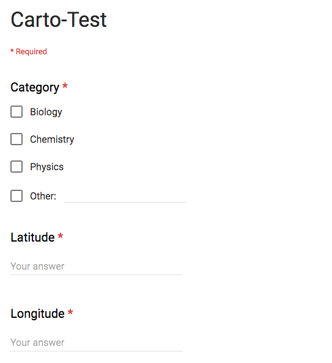
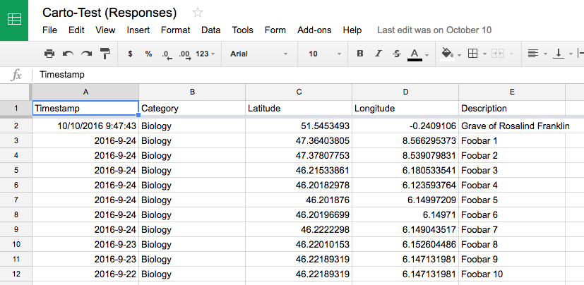
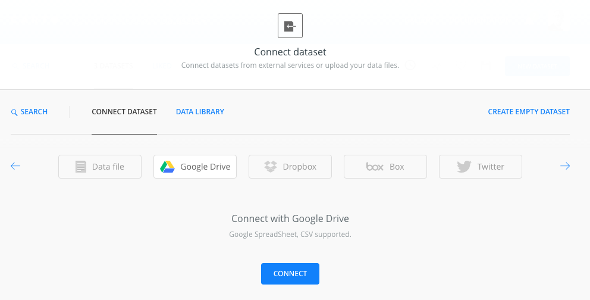
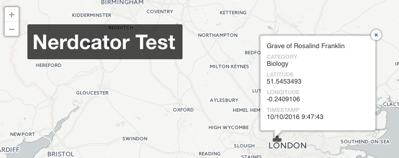

# Carto
* [English Version](#english)
* [German Version](#german)

## English

*CARTO* is an open, powerful, and intuitive platform for discovering and predicting the key insights underlying the location data in our world. While it is a commercial tool, there is also a free account option, which allows you to easily and beautifully display data on a map. For collecting the data one could utilize different ways, for demo purposes we stuck to *Google Forms* for now, but *Carto* does offer endpoints for easily dragging in data from other sources as well.

### Collecting & Visualizing Data

Both Bastian & Aurelia gave this option a a try. By setting up a simple *Google Form* people can either enter data through adding the latitude or longitude ([see Bastian's form](https://docs.google.com/forms/d/e/1FAIpQLSe0e_H-pTPVqVlQK-R-hvuMKn9zyPJ2OpqJ0efL1hPYDhx6BQ/viewform)) or by using the street-level geocoding function ([see Carto Docs](https://carto.com/docs/carto-engine/dataservices-api/geocoding-functions/#street-level-geocoder)).

In either case, you will end up with a *Google Spreadsheet* that contains the data points entered through the form. These can then easily be linked to *Carto* using their *Google Drive*-endpoints.

This data can [then be shown on the *Carto*-map](https://gedankenstuecke.carto.com/viz/1312f3ba-8eba-11e6-b515-0ef7f98ade21/public_map). If you added categories to the *Google Form*, you can assign different symbols for the display on the map. In addition you can also select which data points should be in the tooltips displayed on the map. [Aurelia's map can be found here](https://auremoser.carto.com/builder/fe0d9b1c-9082-11e6-aeba-0e3ebc282e83/embed
).

Some instructions from the [etherpad](https://gedankenstuecke.piratenpad.de/nerdcator)

### Pros
* can easily display the data
* looks pretty beautiful out of the box
* One can in principle even implement a search function
* choosing the Google Drive option for adding a new dataset
* once the form results are sync'd, you could set up a trigger to automatically fill in the_geom field using the street-level geocoding function: <https://carto.com/docs/carto-engine/dataservices-api/geocoding-functions/#street-level-geocoder>
* use `UPDATE nerdcator_entry_form_responses SET the_geom = cdb_geocode_street_point(where_is_this_place_full_address_with_number_city_state_co)` to update dynamically
* styling is nice, and you can add the form responses to the tooltip, easy

### Cons
* It doesn't geocode correctly always, and geocoder won't let you manually edit geom values while syncing.
* automatic sync of a *Google Spreadsheet* to *Carto* is only possible in the paid version.
* data entry through google form is cumbersome

## German

*CARTO* ist eine offene, mächtige und intuitive Platform um Geodatenzu visualisieren etc. Neben einer bezahlten Version gibt es eine kostenlose Einsteiger-Variante, welche ausreicht um Daten einfach auf einer Karte anzuzeigen. Um unsere Geodaten zu sammeln haben wir uns für *Google Forms* entschieden, dank der vielfältigen Import-Möglichkeiten von *Carto* könnte man diese aber auch auswechseln.

### Sammeln & Visualisieren unserer Daten  Data

Sowohl Bastian als auch Aurelia haben es ausprobiert. Mit einem einfachen *Google Form* kann Mensch Daten entweder per Längen- und Breitengrad hinzufügen ([siehe Bastians Formular](https://docs.google.com/forms/d/e/1FAIpQLSe0e_H-pTPVqVlQK-R-hvuMKn9zyPJ2OpqJ0efL1hPYDhx6BQ/viewform)) oder mit Hilfe der *street-level geocoding* Funktion ([siehe Carto Docs (english)](https://carto.com/docs/carto-engine/dataservices-api/geocoding-functions/#street-level-geocoder)).

In beiden Fällen bekommt man ein *Google Spreadsheet* welches die Datenpunkte enthält. Dieses kann man einfach in Carto importieren, dank des *Google Drive*-Importers.

Die so importierten Daten [können dann auf der Carto-Karte angezeigt werden](https://gedankenstuecke.carto.com/viz/1312f3ba-8eba-11e6-b515-0ef7f98ade21/public_map). Wenn das *Google Spreadsheet* Kategorien enthalten hat kann man verschiedenen Kategorien auch verschiedene Icons zuordnen. Dazu kann man auswählen welche Informationen auf in den Tooltips auf der Karte angezeigt werden sollen. [Aurelia's Karte kann man hier sehen](https://auremoser.carto.com/builder/fe0d9b1c-9082-11e6-aeba-0e3ebc282e83/embed
).

Ein paar mehr (englische) Anmerkungen gibt es im Etherpad [etherpad](https://gedankenstuecke.piratenpad.de/nerdcator).

### Vorteile
* Mensch kann die Daten einfach visualisieren
* Ist ohne viel Aufwand hübsch
* Man könnte relativ einfach eine Such-Funktion einfügen
* Von Google Drive kann man Daten einfach importieren
* Man könnte die Street-Level Geokodierung nutzen, siehe https://carto.com/docs/carto-engine/dataservices-api/geocoding-functions/#street-level-geocoder
* `UPDATE nerdcator_entry_form_responses SET the_geom = cdb_geocode_street_point(where_is_this_place_full_address_with_number_city_state_co)` für dynamische Updates
* Das Design ist hübsch und kan kann die Form-Felder einfach zu Tooltips umwandeln.

### Nachteile
* Die automatischen Geocodierungen sind nicht immer korrekt und man kann sie nicht per Hand korrigieren beim Import
* Der automatische Sync von *Google Spreadsheet* zu *Carto* ist nur in der Bezahl-Version möglich.
* Die Dateneingabe mit Google Forms ist nicht sehr bequem

## Hindi
*maybe to come*
