# EpiCollect

* [English Version](#english)
* [German Version](#german)

## English

[**EpiCollect**](http://www.epicollect.net/) is a mobile/web application for collecting geodata with a smartphone. The project was funded by the Wellcome Trust and was designed for collecting epidemiological data directly in the field.

You can create your own project to collect/display data with it, albeit not very easily. Below is a brief description on how to create a project and contribute to it. Our example project lives at [http://plus.epicollect.net/nerdcator/](http://plus.epicollect.net/nerdcator/) and was created using the [online creator](http://plus.epicollect.net/createProject.html).

As there is really no better way to see how it works, but to download it yourself & try to enter a point :)

Here's how:
1. [Download the Android app](https://play.google.com/store/apps/details?id=uk.ac.imperial.epi_collect2&hl=en). Make sure it is EpiCollect+(old) app.
2. Press menu on your phone (menu location differs on each phone)
3. Load project `nerdcator`
4. Start/Resume data collection
5. Add `nerdy_points` and follow the form
6. At the end when you click `Tap button to store record`, select List/Sync entries
7. Click `Send data to Remote Server(s)`

And you're done (it should say "Y" next to your data point).

You can check the points by going to [http://plus.epicollect.net/nerdcator/](http://plus.epicollect.net/nerdcator/) and selecting `"View all"`. You can then either see the data on a Table or on the Map by changing the relevant tab (see the two screenshots below). You can also export it all in csv, etc.

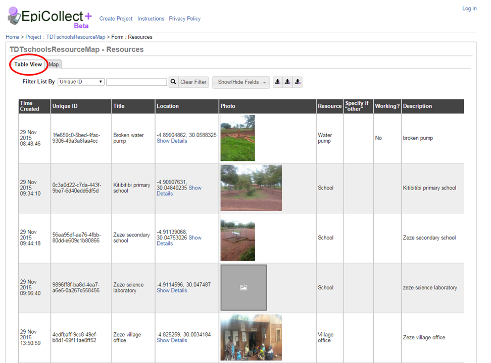

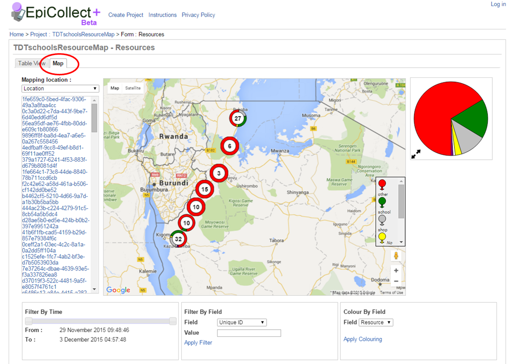

You can also find a step-by-step guide based on screenshots.

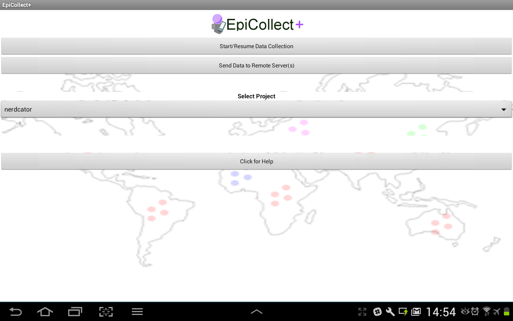

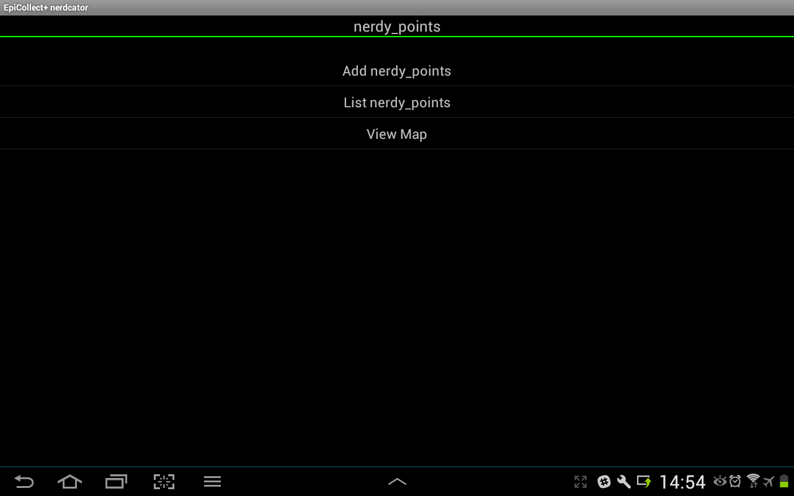

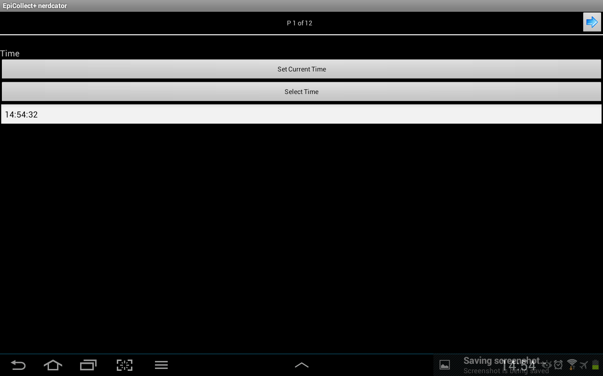

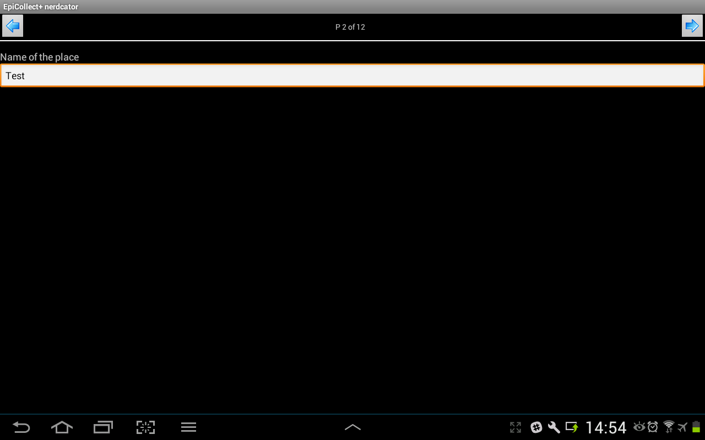

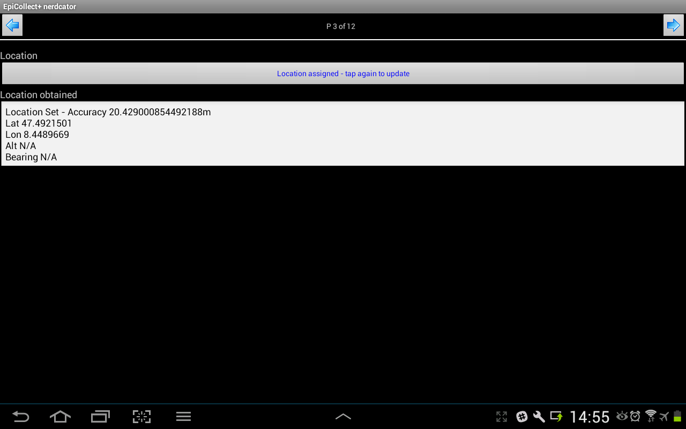

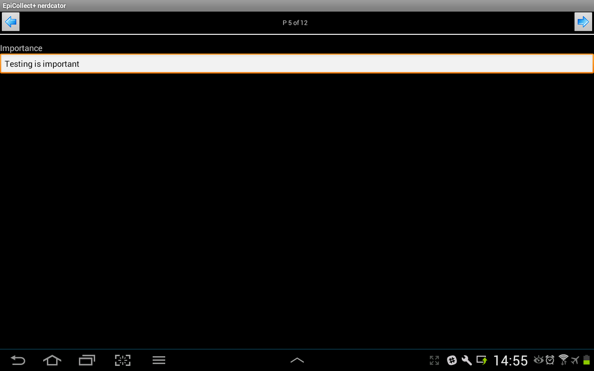

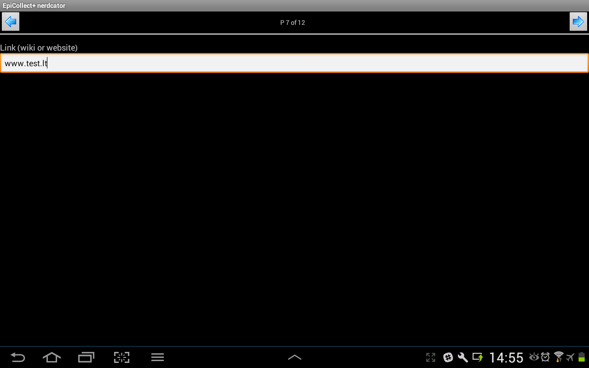

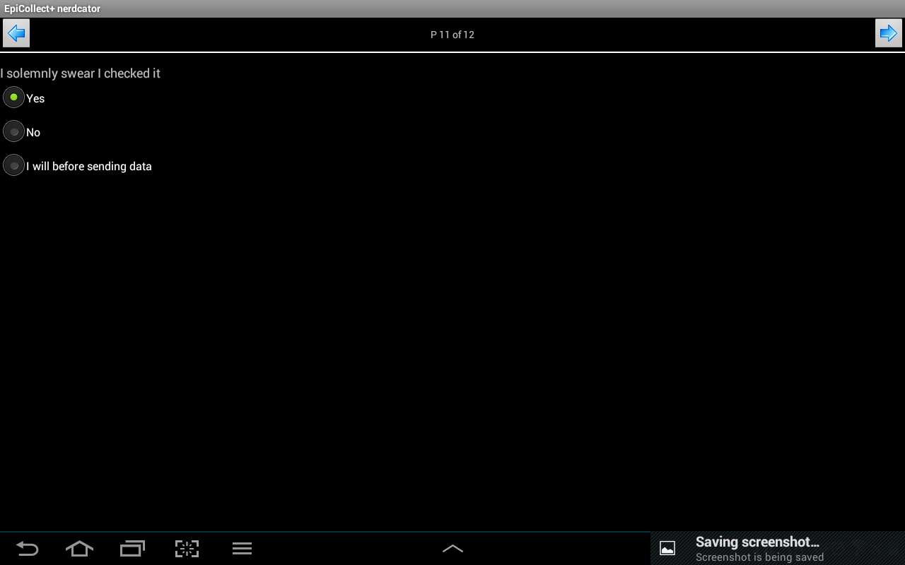

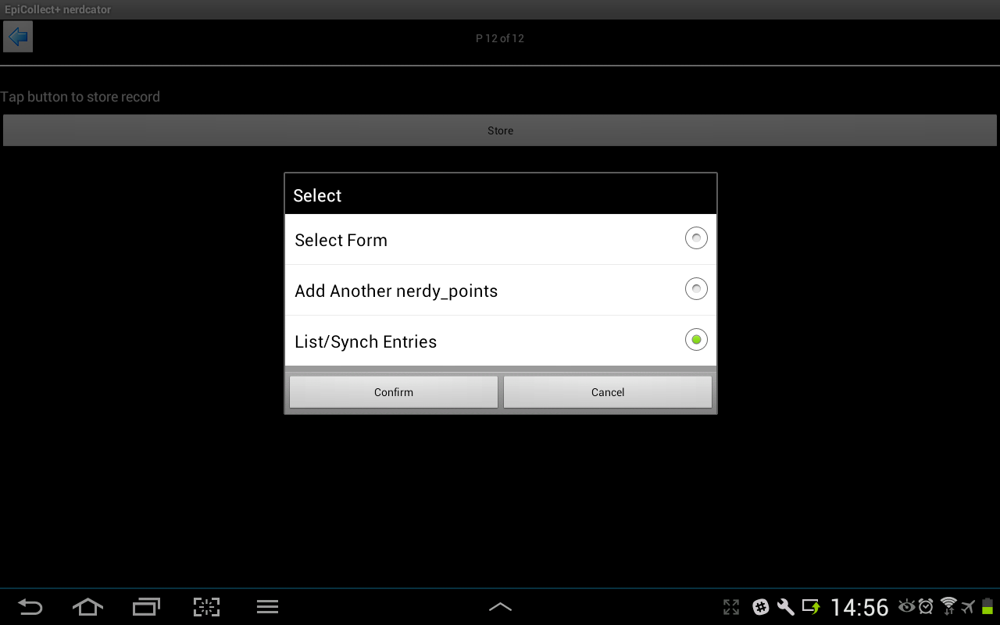

## German
[**EpiCollect**](http://www.epicollect.net/) ist eine App um Geodaten mit seinem Smartphone zu sammeln. Das Projekt wurde vom Wellcome Trust gefördert und entwickelt um epidemiologische Daten im Feld zu sammen.

Mensch kann seine eigenen Projekte erstellen um Geodaten zu sammeln und auf einer Karte darzustellen. Hier gibt es eine kleine Anleitung wie eins sein eigenes Projekt startet. Unser eigenes Nerdcator-Projekt findet mensch unter [http://plus.epicollect.net/nerdcator/](http://plus.epicollect.net/nerdcator/). Die Erstellung wurde mit dem [online creator](http://plus.epicollect.net/createProject.html) gemacht.

Weil es keinen besseren Weg gibt zu sehen wie das Ganze funktioniert, ladet euch die App runter und fügt einen Punkt hinzu:

1. [Ladet die Android app herunter](https://play.google.com/store/apps/details?id=uk.ac.imperial.epi_collect2&hl=en). Passt auf, dass es die *EpiCollect+(old)* app ist.
2. Drückt `Menu` auf eurem Smartphone (Die Position des Buttons hängt vom Smartphone ab)
3. Ladet das Projekt `nerdcator`
4. Drückt `Start/Resume data collection`
5. Fügt `nerdy_points` hinzu und folgt den Anweisungen
6. Am Ende klickt ihr auf  `Tap button to store record`, wählt dort `List/Sync entries` aus.
7. Klickt `Send data to Remote Server(s)`.

Und das war es (es sollte "Y" neben eurem Geodaten-Punkt sagen).

Ihr könnt die Punkte unter  [http://plus.epicollect.net/nerdcator/](http://plus.epicollect.net/nerdcator/) sehen, wählt dort `"View all"`. Eins kann die Daten entweder als Tabelle oder auf einer Karte sehen, in dem mensch zum relevanten Tab wechselt (siehe die beiden Screenshots unten). Darüber hinaus kann eins alle Daten auch als CSV etc. exportieren.

Hier noch eine Screenshot-basierte Schritt-für-Schritt Anleitung:

## Hindi
*maybe to come*
