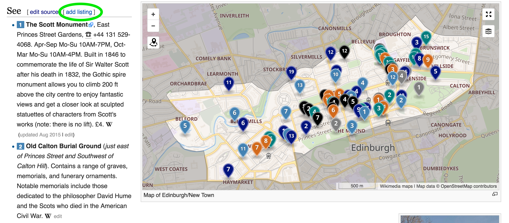

Wikivoyage
==========

From https://en.wikivoyage.org/wiki/Wikivoyage:Wikivoyage_and_Wikitravel:

> Wikitravel was the forerunner of Wikivoyage. After advertising was added to Wikitravel, the articles were copied to Wikivoyage and many editors have added new content and updates to Wikivoyage only. Wikivoyage is non-commercial, and part of the Wikimedia Foundation, along with Wikipedia

There are two main ways to add Nerdcator listings to Wikivoyage:

1. Go to the particular city (or region) where the listing is located. Add it as a "See" or "Do" listing. For example, I've added the James Clerk Maxwell museum to https://en.wikivoyage.org/wiki/Edinburgh/New_Town and added a nerdcator tag (Bastian rightly pointed out that wikivoyage may not like this!)

    In the See section of a location, click on *Add Listing* rather than *Edit Source* because *Add Listing* gives you an easy to use form
    
    
 
    Use the "Find on Map" feature which pulls up Open Street Maps. You can even enter addresses.

    

    In the content section, put a description, and then add "#nerdcator" at the end to make it easy to search for)

2. Go to https://en.wikivoyage.org/wiki/Science_tourism (I found out about this at 7am today!). Add "Listing" in the right section.

    

    Click on Edit Source 
    
    In the text edit window, add a Listing (green circle) rather than a See Listing (Red circle) because this page seems to prefer ordinary listings.
    
    
    

In both cases, you should be able to find your listings (and we should be able to scrape them) if we search for the word "nerdcator" or go to this link: https://en.wikivoyage.org/w/index.php?search=nerdcator
